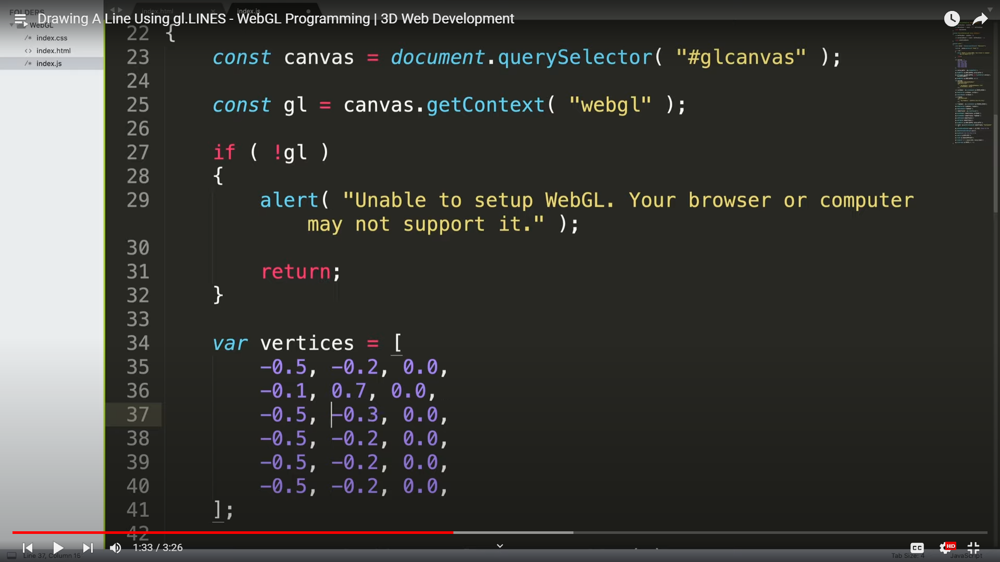

Name : Ihsan Widagdo   
Student ID : 5025211231  
  
  
  
### Process
First i watch the basic video to use gl.LINES and gl.TRIANGLES primitive in this link : <a target="__blank" href="https://www.youtube.com/watch?v=ubplysREKh8">https://www.youtube.com/watch?v=ubplysREKh8</a> and this link <a target="__blank" href="https://www.youtube.com/watch?v=8Q-3e2OVihk&list=PLRtjMdoYXLf4aWJ5WJl8_vBnynl6st_sQ&index=10">https://www.youtube.com/watch?v=8Q-3e2OVihk&list=PLRtjMdoYXLf4aWJ5WJl8_vBnynl6st_sQ&index=10</a> to know how gl.LINES and gl.TRIANGLES primitive work and then i start my progress.

After i can finish my progress to create my first three letters of my name, i ask chatGPT about contrast colour of my favourite colour (silver) and then chatGPT give me answer that dark blue is a contrast colour of silver. I ask chatGPT too about function to toogle between draw lines and draw triangles and also ask about changing the background colour, lines colour, and triangles colour.

Here are some documentations when i watched youtube and asked chatGPT :
1. 
2. 
3. 
4. 
5. 

And here the result of my assignment :

Thank You!!!